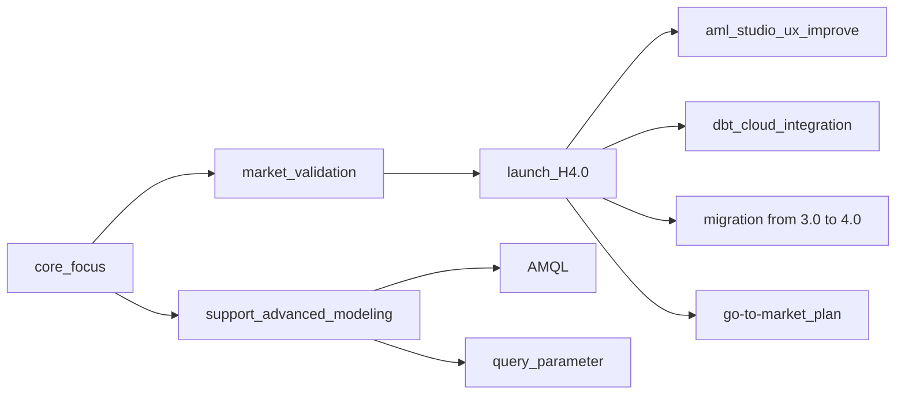

# Context

At the end of each quarter, Modeling team reviews all the projects and share the plan for the next quarter. 

# Agenda

1. Introduce new members (Dương, Nam PV, Tùng LX)
2. Recap 2022 Q3
3. Plan for 2022 Q4

# Welcome new member to team

| Name    | Role     |
|---------|----------|
| Dương   | Product  |
| Nam PV  | Engineer |
| Tùng LX | Engineer |

# Recap 2022 Q3

```
Goal: 
- Q3: Ensure the seamless workflow for AE players to build the core foundation for self-service BI and adopt Engineering best practices
- Q2: Sales team will be confident to sell Holistics 4.0 instead of 3.0 which contribute to strategic priority “Validating AE Market”
```

## How were us 1.5 year ago


## Projects

### Build H4.0 MSP version

- **Goal**: Sales team feels confident demoing 4.0 to prospects
    - ⇒ contribute to our `Phase 2 - Roll out to new customers: Launch Holistics 4.0 broadly to validate product market fit, and change Holistics positioning`
- **Focus**
    - Create a seamless modeling experience (just use UI Modeling to achieve major modeling operations, no need to learn AML)
    - Onboarding new members
- **Progress**
    - UI Modeling: 73% progress
    - Educate users on key actions: 30% progress
- **Some highlights**
    - Preview Markdown file
    - Refresh Modeling structure
    - Edit SQL model
    - A bunch of UX improvement

### Preview Reporting

- Goal
    - Allow users to test their modeling changes before deploying to Production
    - As part of our MSP, this feature is also a key component in the modeling journey
- Progress
    - ✅ Done implementing (but wait for the AML Performance improvement)
- Demo
    - https://cdn.holistics.io/docs/v4/preview-reporting/demo-preview-reporting.mp4

### AML 2.0

- Goal: Provide a better experience for H4.0 users when using both UI View and Code view
    - No import statement
    - No `index.aml` file
    - Introduce Module concept
- Progress
    - ✅ Done implementing
    - 🛠️ Migrating for current 4.0 users (4/15)

### AMQL

- **Goal**: Support AMQL as the foundation to support more Analytics use cases
- **MVP**: Build the foundation for AMQL to replicate explores
- **Progress**: 
  - Building the core (30% progress)

## Customers + $$$

[Holistics - Modern Self-service BI Platform](https://staging-internal.holistics.io/dashboards/v3/12950-holistics-4-0-customers-prospects)


# 2022 Q4 plan

```
💡 Core focus: Launch H4.0 to do market validation + Support advanced modeling options as our competitve advance 
```



## AML Studio UX improvement

- **Goal**: Keep improving AML Studio experience to remove friction and increase the level of confidence for the Growth team when selling H4.0
- **The ultimate goal**: H4.0 will become the default trial experience for 4.0 fit at the end of 2022

## Query Parameter

- **Goal**: Enable users to dynamically modify the query based on users’ input in explore layer

## AMQL

- **Goal**: Support AMQL as the foundation to support more Analytics use cases
- **MVP**: Build the foundation for AMQL to replicate explores
- **Progress**:
    - Building the core (30% progress)
    - Support front-end syntax (50% progress)

## dbt Cloud integration

- **Goal**: all users who’re using dbt Cloud can integrate with Holistics to expose their metadata layer from dbt

## H4.0 migration (from H3.0)

- **Goal**: Prepare upfront for tenants who want to use H4.0 (but still want to keep their current 3.0 modeling setup)

## 20% for experiment