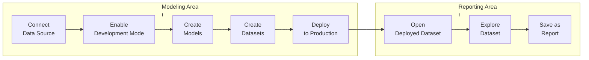
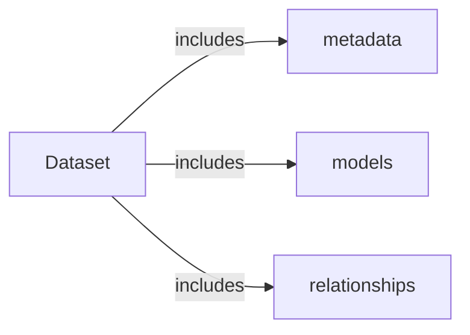

# Holistics modeling best practices 

## Normal workflow 

## Getting Started 

### 1. Connect Data Source

### 2. Enable Development Mode

<video src="https://cdn.holistics.io/docs/as-code/Development-Mode.mp4" controls="controls" muted="muted" class="d-block rounded-bottom-2 border-top width-fit" style="max-width:720px;"></video>

The Development Mode of the project is where you can make changes to the project files without affecting what your end-users are using in Reporting.

### 3. Create Models

A data model is an abstract representation on top of a database table/SQL query that you may manipulate without directly affecting the underlying data.

### 4. Create Datasets

In Holistics, a Dataset is a "container" holding several data models together so they can be explored together, and dictating which join path to be used in a particular analytics use case.

In other words, Dataset is like a mini data mart that enables two things:
* **Data Exploration**: Dataset can be shared to Explorers (non-technical users) to do self-service exploration of the data.
* **Creating Charts**: All Charts in Holistics have to be created from a dataset. This is done either by the Analyst or the Explorer

### 5. Deploy to Production

Once you are happy with your changes in Development, you can Deploy to Production and allowing your Business Users to explore and get insights from the Ready-to-use Dataset in the Reporting layer.